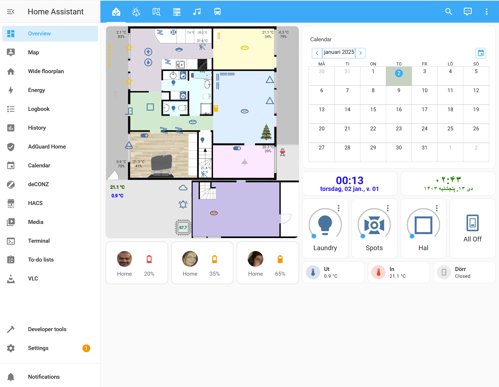

# Javanshir Home Assistant repo 
Home assistant configuration files.

Follow these instructions for installing on Raspberry Pi:
https://www.home-assistant.io/installation/raspberrypi

Here is one screenshot taken from the live flooplan:

